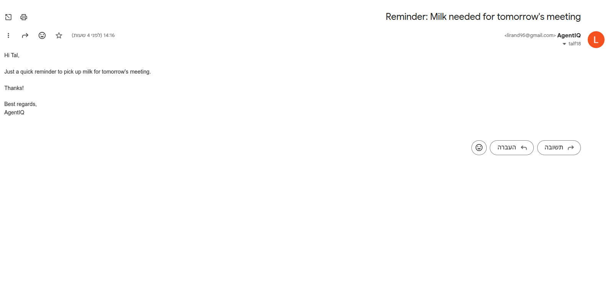
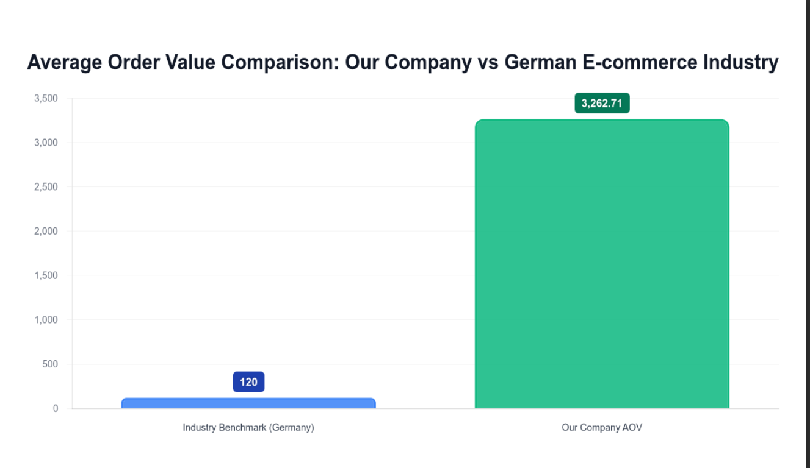
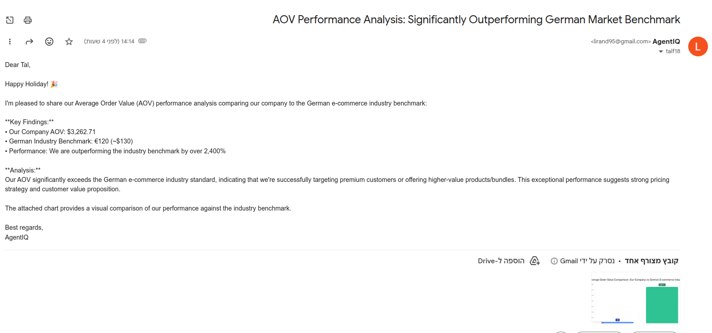

# AgentIQ - Autonomous Business Intelligence Agent

> **⚠️ Demo Project**: This is a technical demonstration project built to showcase agentic AI engineering capabilities. It is not intended for production use.

An AI agent that autonomously answers business questions by selecting and using multiple tools through a ReAct (Reasoning + Acting) control pattern.

## What It Does

AgentIQ connects to your e-commerce database and autonomously decides which tools to use to answer complex business questions. It can query databases, search the web for benchmarks, generate charts, and send email reports - all from a single natural language query.

The agent understands team roles - simply mention "team leader", "CTO", or "VP" and it automatically resolves to the correct email address.

## Tech Stack

- **LLM**: Claude Sonnet 4 (Anthropic API)
- **Control Pattern**: ReAct (Reasoning + Acting loop)
- **Database**: PostgreSQL (Docker)
- **Language**: TypeScript + Node.js
- **Tools**: SQL queries, Chart generation, Web search, Email, Calculator, monitoring

---

## System Architecture
```
                  ┌─────────────────────────────────────┐
                  │            User Interfaces          │
                  ├──────────────────┬──────────────────┤
                  │   CLI Terminal   │  Telegram Bot    │ 
                  │                  │  (Voice/Text)    │                    
                  └──────────┬───────┴────────┬─────────┘
                             │                │
                         Text Query       Voice Message ────► OpenAI Whisper 
                             │                │               (Audio→Text)
                             │                │         
                             │                │
                             ▼                ▼
                  ┌──────────────────────────────────────┐
                  │         AgentIQ Core Agent           │
                  │     (ReAct Control Pattern)          │
                  │   Claude Sonnet 4 Reasoning Engine   │
                  └──────────────────┬───────────────────┘
                                     │
         ┌───────────┬──────────┬────┼────┬──────────┬───────────┐
         │           │          │         │          │           │
         ▼           ▼          ▼         ▼          ▼           ▼
     ┌────────┐ ┌─────────┐ ┌──────┐ ┌───────┐ ┌──────────┐ ┌────────────┐
     │  SQL   │ │   Web   │ │Chart │ │ Email │ │Calculator│ │ Monitoring │
     │  Tool  │ │ Search  │ │ Tool │ │ Tool  │ │   Tool   │ │    Tool    │
     └───┬────┘ └────┬────┘ └───┬──┘ └───┬───┘ └─────┬────┘ └──────┬─────┘
         │           │          │        │           │             │
         ▼           ▼          ▼        ▼           ▼             ▼
        PG         Tavily    Chart.js   SMTP      Math.js       cAdvisor

```

**Flow Example:**
1. User sends voice message via Telegram: *"Compare our AOV to Germany"*
2. Whisper transcribes audio to text
3. AgentIQ processes query through ReAct loop:
   - Iteration 1: SQL Tool → Query database (AOV: $3,262)
   - Iteration 2: Web Search Tool → Find benchmark (€120)
   - Iteration 3: Chart Tool → Generate comparison chart
   - Iteration 4: Email Tool → Send to team leader
4. Bot replies with results + chart image

## Example Workflows

### 1. Email Tool
```bash
npm start "Remind the team leader to bring milk for tomorrow's meeting"
```



---

### 2. Web Search + Email
```bash
npm start "Find the cheapest flights from Paris to Miami in April and send to team leader"
```


---

### 3. All Tools: SQL + Web Search + Chart + Email
```bash
npm start "Compare our average order value to the German e-commerce industry benchmark, create a comparison chart, and email it to the team leader with happy holidays message"
```

**Agent autonomously:**
1. Queries database for our AOV
2. Searches web for German industry benchmark
3. Generates comparison chart
4. Emails results with chart attached




---

## With Agent vs Without Agent

**Without AgentIQ** (Manual Process):
1. Open database client
2. Ask ChatGPT to write SQL query for AOV
3. Copy/paste query, run it → Result: $3,262
4. Open browser, search "Germany ecommerce AOV 2024"
5. Read articles, extract benchmark: €120
6. Open spreadsheet tool to create comparison chart
7. Export chart as PNG
8. Open Gmail, compose email
9. Attach chart, write message, send

⏱️ **Time: ~15-20 minutes**  
📋 **Steps: 9 manual actions**  
🔄 **Context switching: 5+ different tools**

---

**With AgentIQ** (Autonomous):
```bash
npm start "Compare our AOV to Germany industry, create chart, email to team leader"
```

⏱️ **Time: ~30 seconds**  
📋 **Steps: 1 command**  
🔄 **Context switching: 0**

The agent autonomously executes all 9 steps in a single command.

---
